# Infographics collection

collection of personal infographics

## Essential Coding Style Guide

## COVID-19

## Endianness

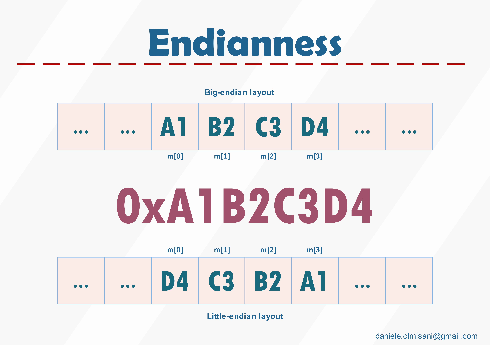

## Productivity Rules

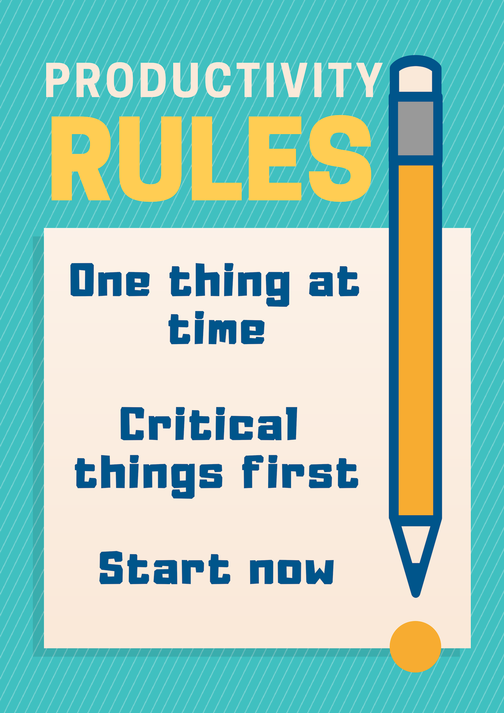

## Exceptional Bugs

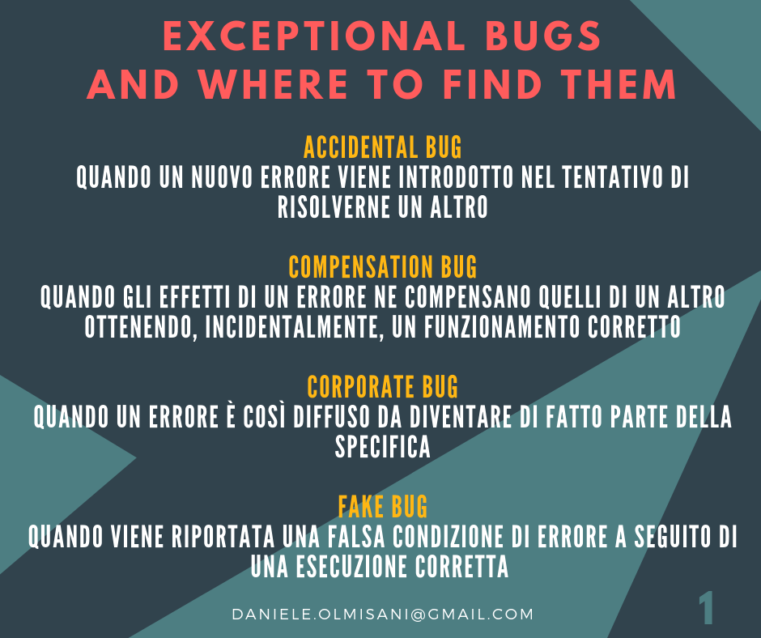
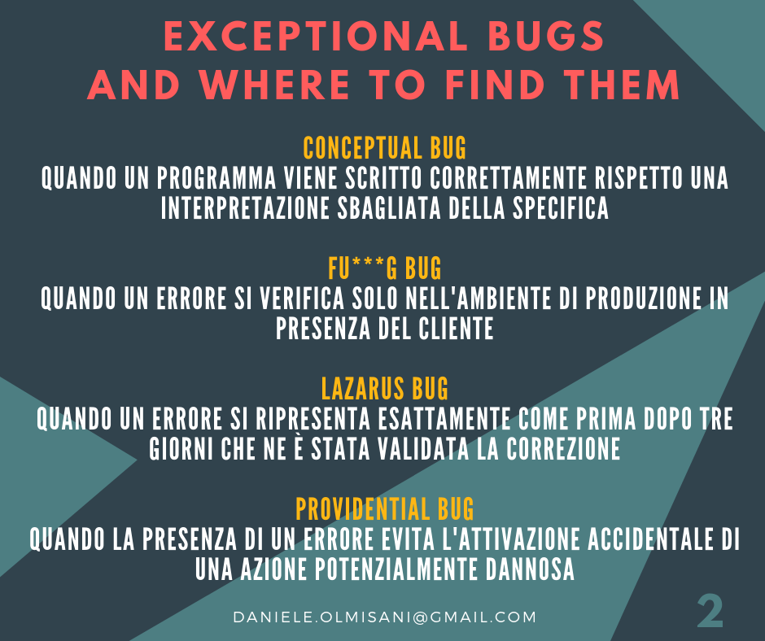

## Engineering Rules

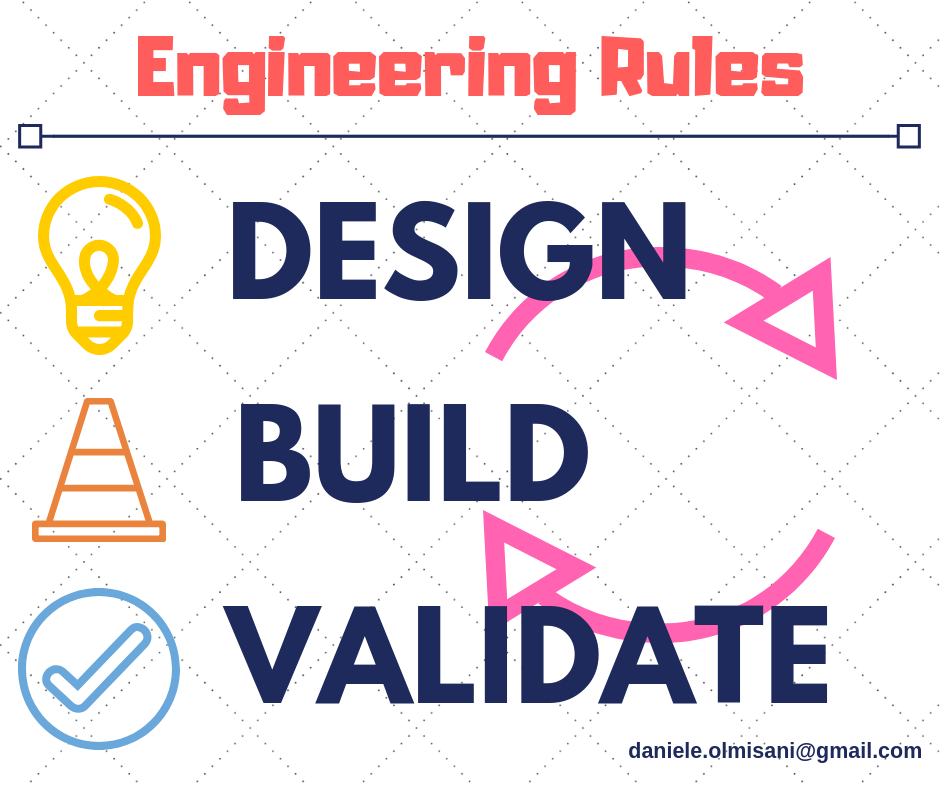

## Making Mistakes in Program Management

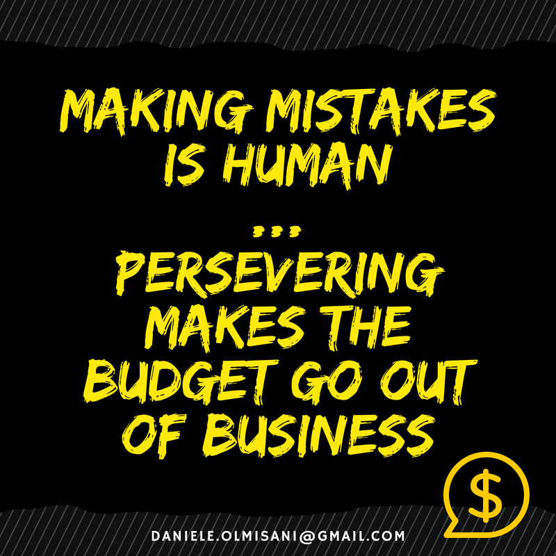

## Management Rules 

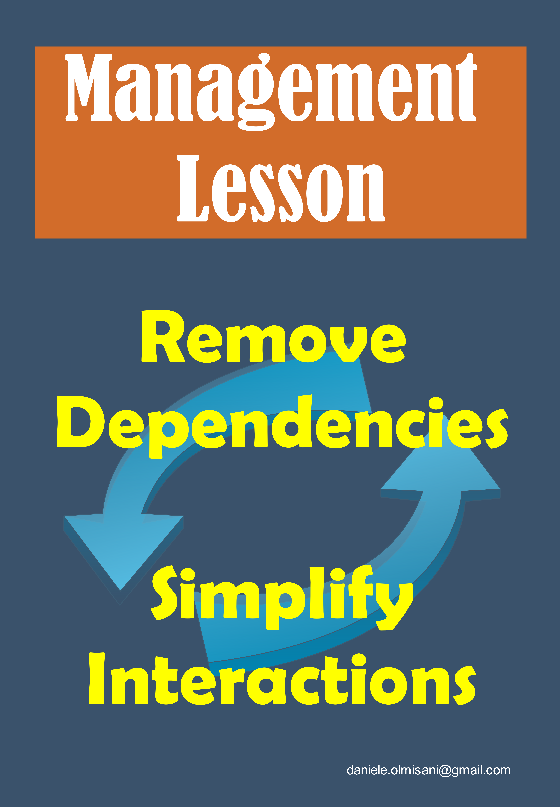

## Complexity Vs. Security 

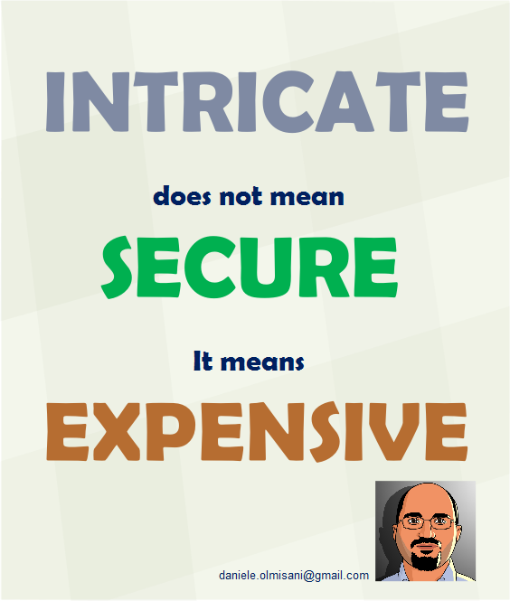

## Monty Hall problem

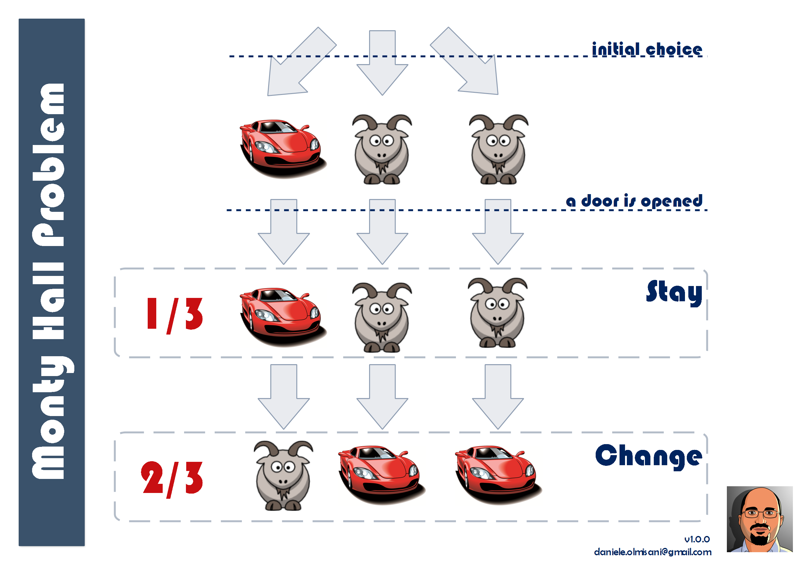

## Six Simple Habits

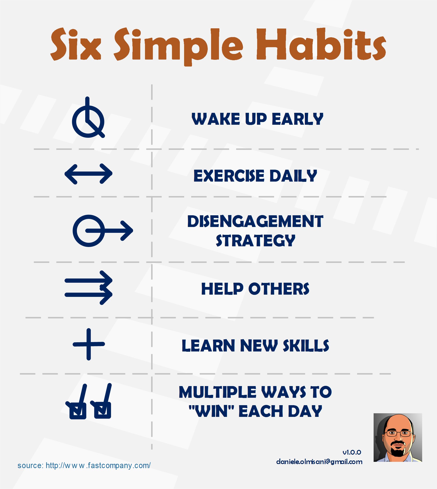

## System Design

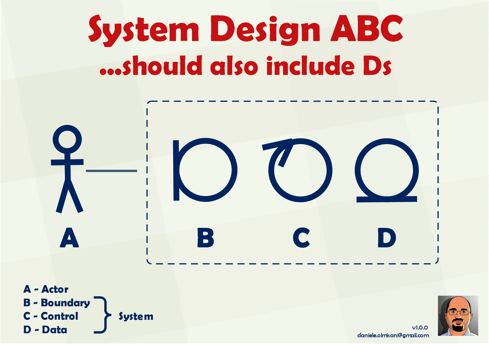

## Versioning for Applications

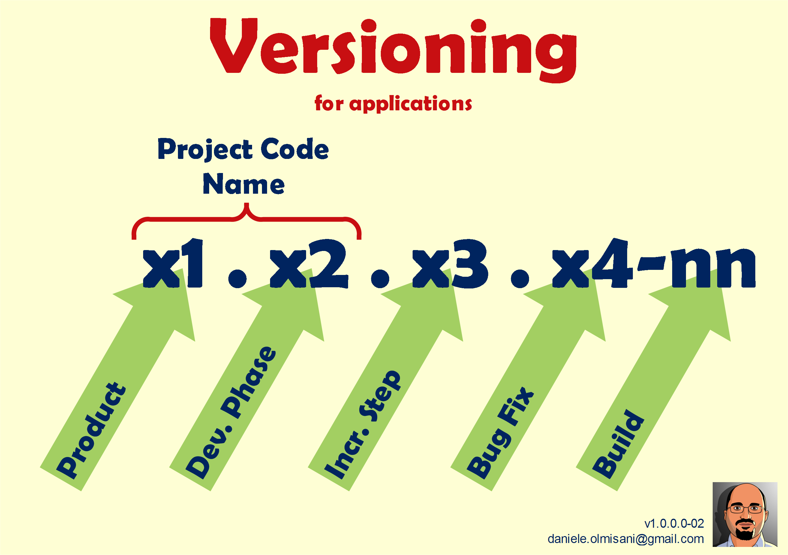

## Writing Principles

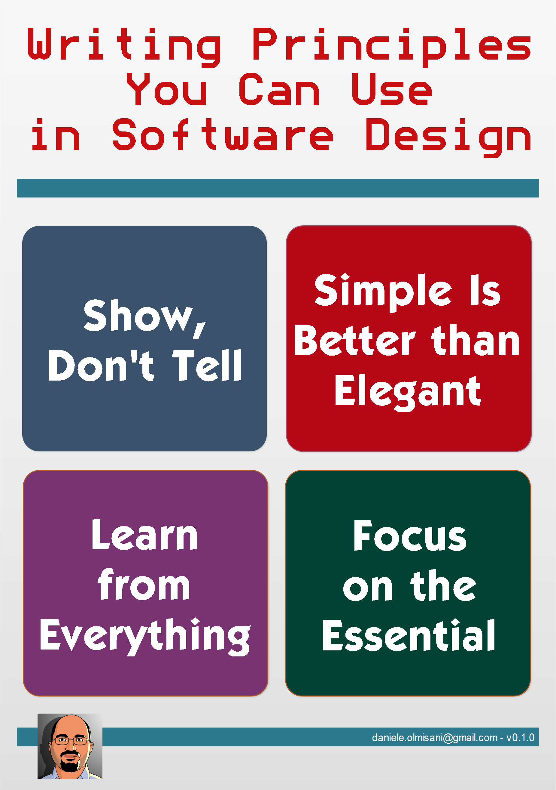

## Work Smarter

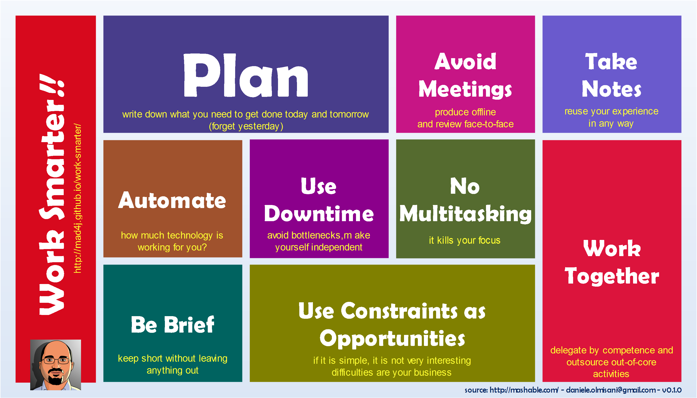

## Good Old SOLID Design

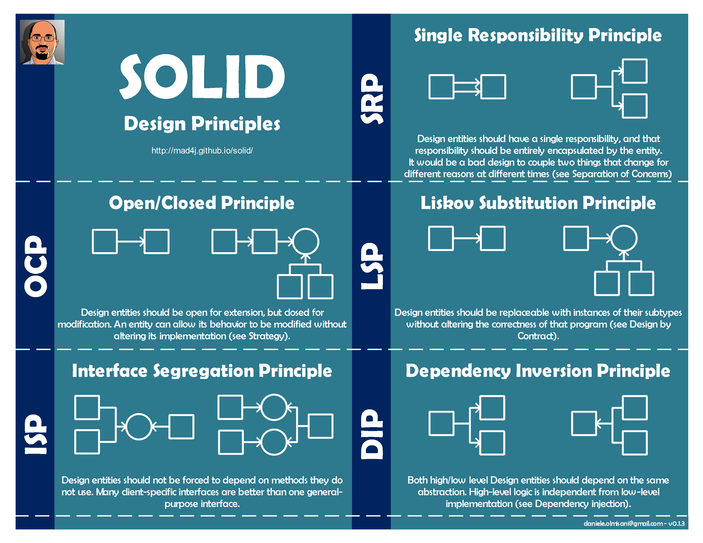
