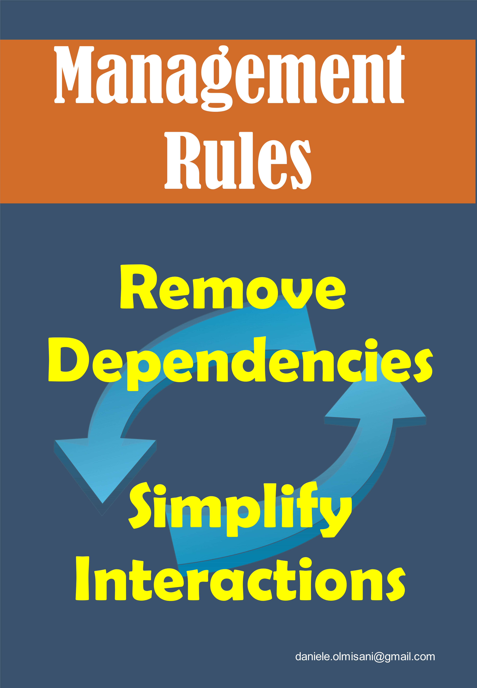
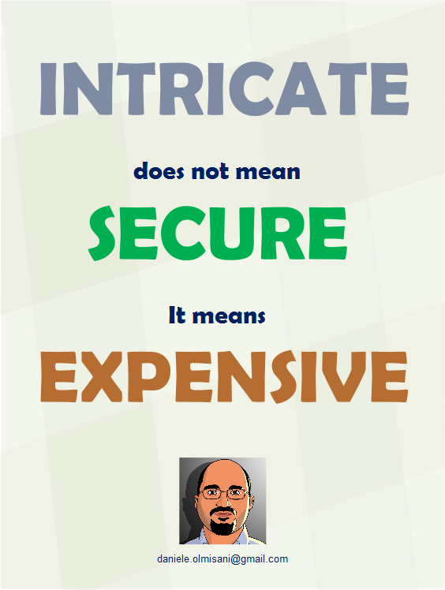
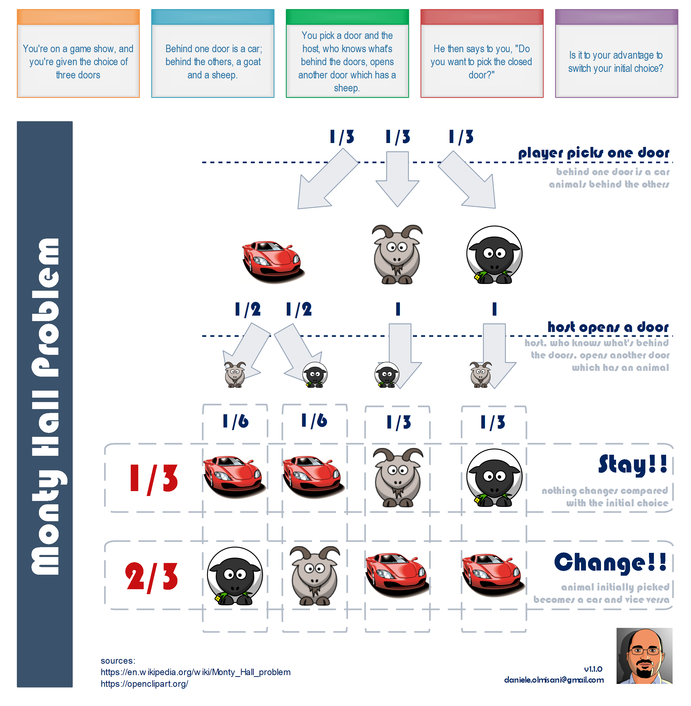
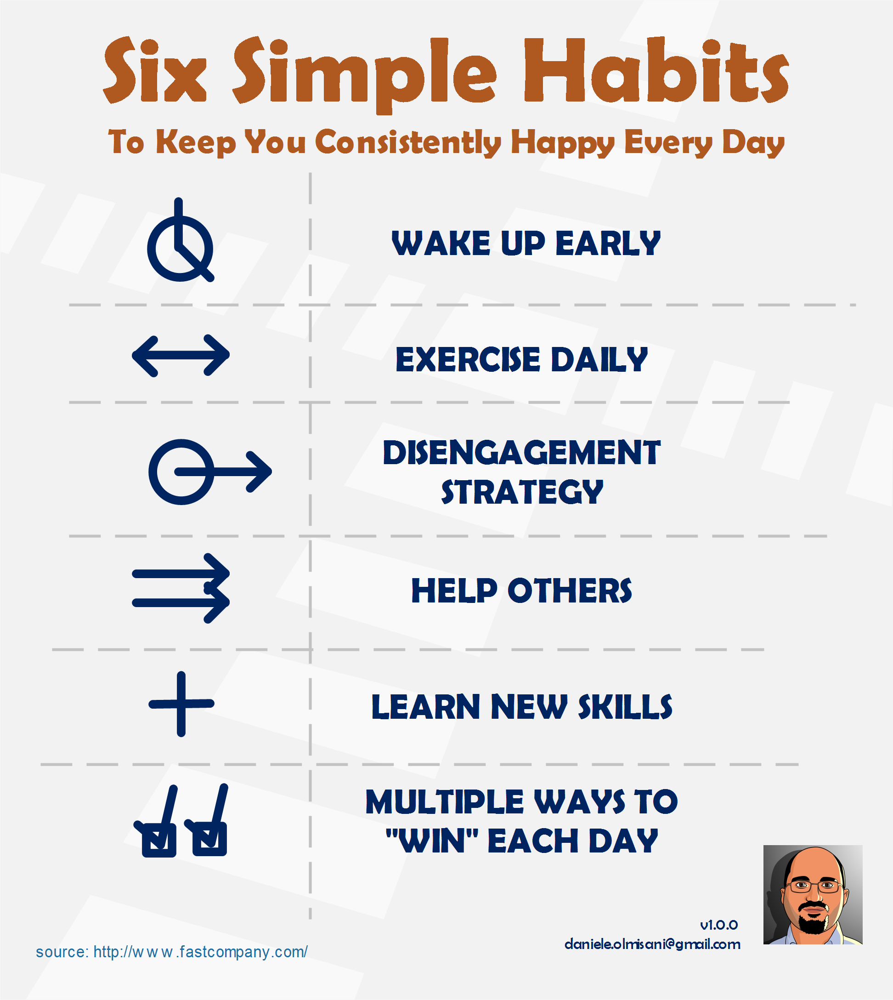

# Infographics collection

collection of personal infographics

## Essential Coding Style Guide

## COVID-19

## Endianness

## Productivity Rules

## Exceptional Bugs

## Engineering Rules

## Making Mistakes in Program Management

## Management Rules 

## Complexity Vs. Security 

## Monty Hall problem

## Six Simple Habits

## System Design

## Versioning for Applications

## Writing Principles

## Work Smarter

## Good Old SOLID Design

